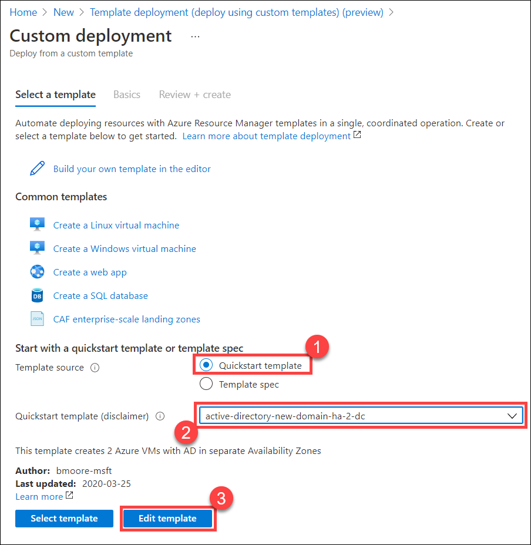
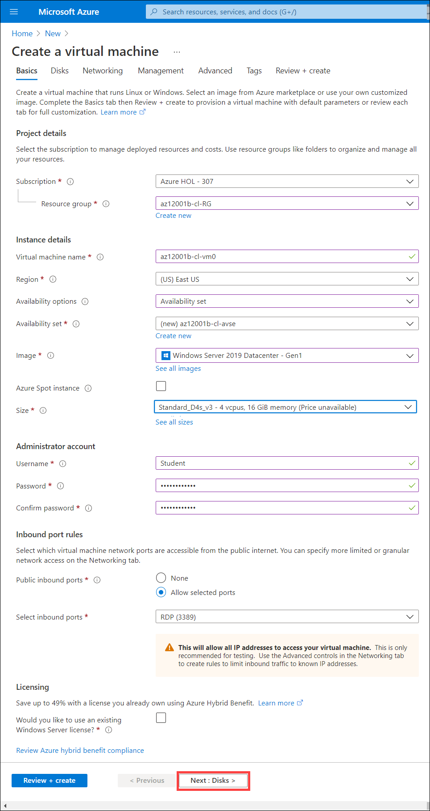
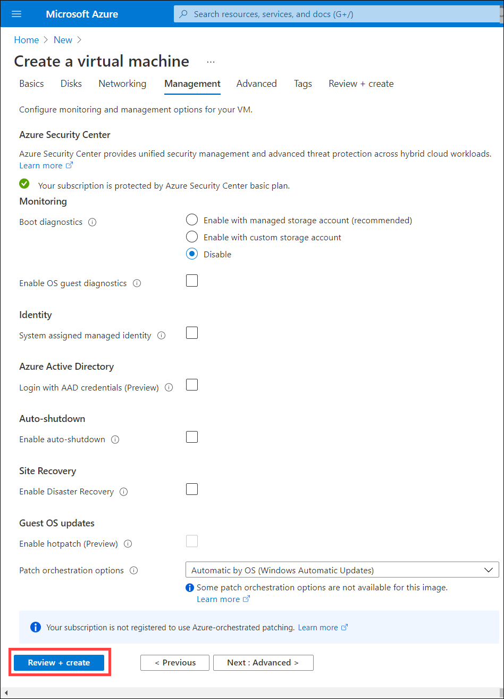
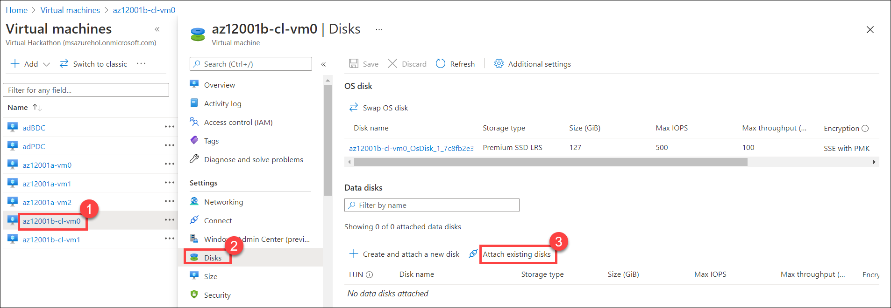
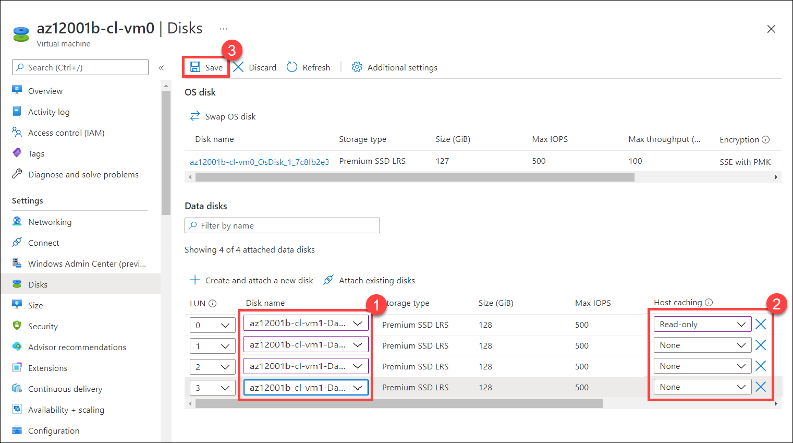

# AZ 120 Module 1: Foundations of SAP on Azure
# Lab 1b: Implementing Windows clustering on Azure VMs

Estimated Time: 120 minutes

All tasks in this lab are performed from the Azure portal (including the PowerShell Cloud Shell session)  

   > **Note**: When not using Cloud Shell, the lab virtual machine must have Az PowerShell module installed [**https://docs.microsoft.com/en-us/powershell/azure/install-az-ps-msi?view=azps-2.8.0**](https://docs.microsoft.com/en-us/powershell/azure/install-az-ps-msi?view=azps-2.8.0).

Lab files: none

## Scenario
  
In preparation for deployment of SAP NetWeaver on Azure, with SQL Server as the database management system, Adatum Corporation wants to explore the process of implementing clustering on Azure VMs running Windows Server 2019.

## Objectives
  
After completing this lab, you will be able to:

-   Provision Azure compute resources necessary to support highly available SAP NetWeaver deployments.

-   Configure operating system of Azure VMs running Windows Server 2019 to support a highly available SAP NetWeaver deployment.

-   Provision Azure network resources necessary to support highly available SAP NetWeaver deployments.

## Requirements

-   A Microsoft Azure subscription with the sufficient number of available DSv2 and Dsv3 vCPUs (one Standard_DS1_v2 VM with 1 vCPU and four Standard_D4s_v3 VMs with 4 vCPUs each) in the Azure region you intend to use for this lab

-   A lab computer running Windows 10, Windows Server 2016, or Windows Server 2019 with access to Azure

> **Note**: Consider using **East US** or **East US2** regions for deployment of your resources.

## Exercise 1: Provision Azure compute resources necessary to support highly available SAP NetWeaver deployments

Duration: 50 minutes

In this exercise, you will deploy Azure infrastructure compute components necessary to configure Failover Clustering on Azure VMs running Windows Server 2019. This will involve deploying a pair of Active Directory domain controllers, followed by a pair of Azure VMs running Windows Server 2019 in the same availability set within the same virtual network. To automate the deployment of domain controllers, you will use an Azure Resource Manager QuickStart template available from <https://github.com/Azure/azure-quickstart-templates/tree/master/active-directory-new-domain-ha-2-dc>

### Task 1: Deploy a pair of Azure VMs running highly available Active Directory domain controllers by using an Azure Resource Manager template

1.  From the lab computer, start a Web browser, and navigate to the Azure portal at https://portal.azure.com

1.  If prompted, sign in with the work or school or personal Microsoft account with the owner or contributor role to the Azure subscription you will be using for this lab.

1.  In the Azure portal, click **+ Create a resource**.

1.  From the **New** blade, initiate creation of a new **Template deployment (deploy using custom template)**.

1.  Back on the **Custom deployment** blade, in the **Load a GitHub quickstart template** drop-down list, select the entry **active-directory-new-domain-ha-2-dc**, and click **Select template**.

    

    > **Note**: Alternatively, you can launch the deployment by navigating to Azure Quickstart Templates page at <https://github.com/Azure/azure-quickstart-templates>, locating the template named **Create 2 new Windows VMs, create a new AD Forest, Domain, and 2 DCs in an availability set**, and initiating its deployment by clicking **Deploy to Azure** button.

1.  On the **Custom deployment** blade, click **Edit template**.

1.  On the **Edit template** blade, apply the following changes and select **Save**:

    -   in the line **66**, replace `"adVMSize": "Standard_DS2_v2",` with `"adVMSize": "Standard_D4s_v3",`

    -   in the line **78**, replace `"imageSKU": "2016-Datacenter",` with `"imageSKU": "2019-Datacenter",`.

1.  Back on the **Create a new AD Domain with 2 Domain Controllers** blade, specify the following settings and click **Review + create**, followed by **Create** to initiate the deployment:

    -   Subscription: *the name of your Azure subscription*

    -   Resource group: *the name of a new resource group* **az12001b-ad-RG**

    -   Location: *an Azure region where you can deploy Azure VMs*

    > **Note**: Consider using **East US** or **East US2** regions for deployment of your resources. 

    -   Admin Username: **student**

    -   Password: **/Gx^zW(_m34h**

    -   Domain Name: **adatum.com**

    -   DnsPrefix: *any unique valid DNS prefix*

    -   Pdc RDP Port: **3389**

    -   Bdc RDP Port: **13389**

    -   _artifacts Location: **https://raw.githubusercontent.com/Azure/azure-quickstart-templates/master/active-directory-new-domain-ha-2-dc/**

    -   _artifacts Location Sas Token: *leave blank*

    -   Location: **[resourceGroup().location]**
    
    -   Ad VM Size: **Standard_D4s_v3**

    

    > **Note**: The deployment should take about 35 minutes. Wait for the deployment to complete before you proceed to the next task.

### Task 2: Deploy a pair of Azure VMs running Windows Server 2016 in the same availability set.

1. From the lab computer, in the Azure portal, use the **Search resources, services, and docs** text box at the top of the Azure portal page to search for and navigate to the **Virtual machines** blade, then, on the **Virtual machines** blade, select **+ Add** and, in the drop-down menu, select **Virtual machine**.

1. On the **Basics** tab of the **Create a virtual machine** blade, specify the following settings and select **Next: Disks >** (leave all other settings with their default value):

    -   Subscription: *the name of your Azure subscription*

    -   Resource group: *the name of a new resource group* **az12001b-cl-RG**

    -   Virtual machine name: **az12001b-cl-vm0**

    -   Region: *the same Azure region where you deployed the Azure VMs in the previous task*

    -   Availability options: **Availability set**

    -   Availability set: *a new availability set named* **az12001b-cl-avset** *with 2 fault domains and 5 update domains*

    -   Image: **Windows Server 2019 Datacenter**

    -   Size: **Standard D4s v3**

    -   Username: **student**

    -   Password: **Pa55w.rd1234**

    -   Public inbound ports: **Allow selected ports**

    -   Select inbound ports: **RDP (3389)**

    -   You already have a Windows license?: **No**

    

    -   OS disk type: **Premium SSD**

    

    -   Virtual network: **adVNET**

    -   Subnet name: *a new subnet named* **clSubnet**

    -   Subnet address range: **10.0.1.0/24**

    -   Public IP address: *a new IP address named* **az12001b-cl-vm0-ip**

    -   NIC network security group: **Basic**

    -   Public inbound ports: **Allow selected ports**

    -   Select inbound ports: **RDP (3389)**

    -   Accelerated networking: **On**

    -   Place this virtual machine behind an existing load balancing solutions: **No**

    

    -   Boot diagnostics: **Disable**

    -   OS guest diagnostics: **Off**

    -   System assigned managed identity: **Off**

    -   Login with AAD credentials (Preview): **Off**

    -   Enable auto-shutdown: **Off**

    -   Extensions: *None*

    -   Tags: *None*

    

1.  Do not wait for the provisioning to complete but continue to the next step.

1.  Provision another **Windows Server 2019 Datacenter** Azure VM with the following settings:

    -   Subscription: *the name of your Azure subscription*

    -   Resource group: *the name of a new resource group* **az12001b-cl-RG**

    -   Virtual machine name: **az12001b-cl-vm1**

    -   Region: *the same Azure region where you deployed the first **Windows Server 2019 Datacenter** Azure VM in this task*

    -   Availability options: **Availability set**

    -   Availability set: **az12001b-cl-avset**

    -   Image: **Windows Server 2019 Datacenter**

    -   Size: **Standard D4s v3**

    -   Username: **student**

    -   Password: **Pa55w.rd1234**

    -   Public inbound ports: **Allow selected ports**

    -   Select inbound ports: **RDP (3389)**

    -   You already have a Windows license?: **No**

    -   OS disk type: **Premium SSD**

    -   Virtual network: **adVNET**

    -   Subnet name: **clSubnet**

    -   Public IP address: *a new IP address named* **az12001b-cl-vm1-ip**

    -   NIC network security group: **Basic**

    -   Public inbound ports: **Allow selected ports**

    -   Select inbound ports: **RDP (3389)**

    -   Accelerated networking: **On**

    -   Place this virtual machine behind an existing load balancing solutions: **No**

    -   Boot diagnostics: **Disable**

    -   OS guest diagnostics: **Off**

    -   System assigned managed identity: **Off**

    -   Login with AAD credentials (Preview): **Off**

    -   Enable auto-shutdown: **Off**

    -   Enable backup: **Off**

    -   Extensions: *None*

    -   Tags: *None*

1.  Wait for the provisioning to complete. This should take a few minutes.

### Task 3: Create and configure Azure VMs disks

1.  In the Azure Portal, start a PowerShell session in Cloud Shell. 

    > **Note**: If this is the first time you are launching Cloud Shell in the current Azure subscription, you will be asked to create an Azure file share to persist Cloud Shell files. If so, accept the defaults, which will result in creation of a storage account in an automatically generated resource group.

1. In the Cloud Shell pane, run the following command to set the value of the variable `$resourceGroupName` to the name of the resource group containing the resources you provisioned in the previous task:

    ```
    $resourceGroupName = 'az12001b-cl-RG'
    ```

1.  In the Cloud Shell pane, run the following command, to create the first set of 4 managed disks that you will attach to the first Azure VM you deployed in the previous task:

    ```
    $location = (Get-AzResourceGroup -Name $resourceGroupName).Location

    $diskConfig = New-AzDiskConfig -Location $location -DiskSizeGB 128 -AccountType Premium_LRS -OsType Windows -CreateOption Empty

    for ($i=0;$i -lt 4;$i++) {New-AzDisk -ResourceGroupName $resourceGroupName -DiskName az12001b-cl-vm0-DataDisk$i -Disk $diskConfig}
    ```

1.  In the Cloud Shell pane, run the following command, to create the second set of 4 managed disks that you will attach to the second Azure VM you deployed in the previous task:

    ```
    for ($i=0;$i -lt 4;$i++) {New-AzDisk -ResourceGroupName $resourceGroupName -DiskName az12001b-cl-vm1-DataDisk$i -Disk $diskConfig}
    ```

1.  In the Azure portal, navigate to the blade of the first Azure VM you provisioned in the previous task (**az12001b-cl-vm0**).

1.  From the **az12001b-cl-vm0** blade, navigate to the **az12001b-cl-vm0 - Disks** blade.

    

1.  From the **az12001b-cl-vm0 - Disks** blade, attach data disks with the following settings to az12001b-cl-vm0:

    -   LUN: **0**

    -   Disk name: **az12001b-cl-vm0-DataDisk0**

    -   Resource group: *the name of the resource group you used when deploying the pair of **Windows Server 2019 Datacenter** Azure VMs in the previous task*

    -   HOST CACHING: **Read-only**

1.  Repeat the previous step to attach the remaining 3 disks with the prefix **az12001b-cl-vm0-DataDisk** (for the total of 4). Assign the LUN number matching the last character of the disk name. For the last disk (LUN **4**), set HOST CACHING to **None**.

    

1.  Save your changes. 

1.  In the Azure portal, navigate to the blade of the second Azure VM you provisioned in the previous task (**az12001b-cl-vm1**).

1.  From the **az12001b-cl-vm1** blade, navigate to the **az12001b-cl-vm1 - Disks** blade.

1.  From the **az12001b-cl-vm1 - Disks** blade, attach data disks with the following settings to az12001b-cl-vm1:

    -   LUN: **0**

    -   Disk name: **az12001b-cl-vm1-DataDisk0**

    -   Resource group: *the name of the resource group you used when deploying the pair of **Windows Server 2019 Datacenter** Azure VMs in the previous task*

    -   HOST CACHING: **Read-only**

1.  Repeat the previous step to attach the remaining 3 disks with the prefix **az12001b-cl-vm1-DataDisk** (for the total of 4). Assign the LUN number matching the last character of the disk name. For the last disk (LUN **4**), set HOST CACHING to **None**.

    

1.  Save your changes. 

> **Result**: After you completed this exercise, you have provisioned Azure compute resources necessary to support highly available SAP NetWeaver deployments.


## Exercise 2: Configure operating system of Azure VMs running Windows Server 2019 to support a highly available SAP NetWeaver installation

Duration: 40 minutes

### Task 1: Join Windows Server 2019 Azure VMs to the Active Directory domain.

   > **Note**: Before you start this task, ensure that the template deployment you initiated in the last task of the previous exercise has successfully completed. 

1.  In the Azure Portal, navigate to the blade of the virtual network **adVNET**, which was provisioned automatically in the first exercise of this lab.

1.  Display the **adVNET - DNS servers** blade and note that the virtual network is configured with the private IP addresses assigned to the domain controllers deployed in the first exercise of this lab as its DNS servers.

1.  In the Azure Portal, start a PowerShell session in Cloud Shell. 

1. In the Cloud Shell pane, run the following command to set the value of the variable `$resourceGroupName` to the name of the resource group containing the pair of **Windows Server 2019 Datacenter** Azure VMs you provisioned in the previous exercise:

    ```
    $resourceGroupName = 'az12001b-cl-RG'
    ```

1.  In the Cloud Shell pane, run the following command, to join the Windows Server 2019 Azure VMs you deployed in the second task of the previous exercise to the **adatum.com** Active Directory domain:

    ```
    $location = (Get-AzureRmResourceGroup -Name $resourceGroupName).Location

    $settingString = '{"Name": "adatum.com", "User": "adatum.com\\student", "Restart": "true", "Options": "3"}'

    $protectedSettingString = '{"Password": "/Gx^zW(_m34h"}'

    $vmNames = @('az12001b-cl-vm0','az12001b-cl-vm1')

    foreach ($vmName in $vmNames) { Set-AzVMExtension -ResourceGroupName $resourceGroupName -ExtensionType 'JsonADDomainExtension' -Name 'joindomain' -Publisher "Microsoft.Compute" -TypeHandlerVersion "1.0" -Vmname $vmName -Location $location -SettingString $settingString -ProtectedSettingString $protectedSettingString }
    ```

1.  Wait for the script to complete before proceeding to the next task.


### Task 2: Configure storage on Azure VMs running Windows Server 2019 to support a highly available SAP NetWeaver installation.

1.  In the Azure Portal, navigate to the blade of the virtual virtual machine **az12001b-cl-vm0**, which you provisioned in the first exercise of this lab.

1.  From the **az12001b-cl-vm0** blade, connect to the virtual machine guest operating system by using Remote Desktop. When prompted to authenticate, provide the following credentials:

    -   User name: **ADATUM\student**

    -   Password: **/Gx^zW(_m34h**

1.  Within the RDP session to az12001b-cl-vm0, in Server Manager, navigate to the **Local Server** view and turn off temporarily **IE Enhanced Security Configuration**.

1.  Within the RDP session to az12001b-cl-vm0, in Server Manager, navigate to the **File and Storage Services** -> **Servers** node. 

1.  Navigate to the **Storage Pools** view and verify that you see all the disks you attached to the Azure VM in the previous exercise.

1.  Use the **New Storage Pools Wizard** to create a new storage pool with the following settings:

    -   Name: **Data Storage Pool**

    -   Physical Disks: *select the 3 disks with disk numbers corresponding to the first three LUN numbers (0-2) and set their allocation to* **Automatic**

    > **Note**: Use the entry in the **Chassis** column to identify the **LUN** number.

1.  Use the **New Virtual Disk Wizard** to create a new virtual disk with the following settings:

    -   Virtual Disk Name: **Data Virtual Disk**

    -   Storage Layout: **Simple**

    -   Provisioning: **Fixed**

    -   Size: **Maximum size**

1.  Use the **New Volume Wizard** to create a new volume with the following settings:

    -   Server and Disk: *accept the default values*

    -   Size: *accept the default values*

    -   Drive letter: **M**

    -   File system: **ReFS**

    -   Allocation unit size: **Default**

    -   Volume label: **Data**

1.  Back in the **Storage Pools** view, use the **New Storage Pools Wizard** to create a new storage pool with the following settings:

    -   Name: **Log Storage Pool**

    -   Physical Disks: *select the last of 4 disks and set its allocation to* **Automatic**

1.  Use the **New Virtual Disk Wizard** to create a new virtual disk with the following settings:

    -   Virtual Disk Name: **Log Virtual Disk**

    -   Storage Layout: **Simple**

    -   Provisioning: **Fixed**

    -   Size: **Maximum size**

1.  Use the **New Volume Wizard** to create a new volume with the following settings:

    -   Server and Disk: *accept the default values*

    -   Size: *accept the default values*

    -   Drive letter: **L**

    -   File system: **ReFS**

    -   Allocation unit size: **Default**

    -   Volume label: **Log**

1.  Repeat the previous step in this task to configure storage on az12001b-cl-vm1.

### Task 3: Prepare for configuration of Failover Clustering on Azure VMs running Windows Server 2019 to support a highly available SAP NetWeaver installation.

1.  Within the RDP session to az12001b-cl-vm0, start a Windows PowerShell ISE session and install Failover Clustering and Remote Administrative tools features on both az12001b-cl-vm0 and az12001b-cl-vm1 by running the following:

    ```
    $nodes = @('az12001b-cl-vm1', 'az12001b-cl-vm0')

    Invoke-Command $nodes {Install-WindowsFeature Failover-Clustering -IncludeAllSubFeature -IncludeManagementTools} 

    Invoke-Command $nodes {Install-WindowsFeature RSAT -IncludeAllSubFeature -Restart} 
    ```

    > **Note**: This will result in restart of the guest operating system of both Azure VMs.

1.  On the lab computer, in the Azure Portal, click **+ Create a resource**.

1.  From the **New** blade, initiate creation of a new **Storage account** with the following settings:

    -   Subscription: *the name of your Azure subscription*

    -   Resource group: *the name of the resource group containing the pair of **Windows Server 2019 Datacenter** Azure VMs you provisioned in the previous exercise*

    -   Storage account name: *any unique name consisting of between 3 and 24 letters and digits*

    -   Location: *the same Azure region where you deployed the Azure VMs in the previous exercise*

    -   Performance: **Standard**

    -   Account kind: **Storage (general purpose v1)**

    -   Replication: **Locally-redundant storage (LRS)**

    -   Connectivity method: **Public endpoint (all networks)**

    -   Secure transfer required: **Enabled**

    -   Large file shares: **Disabled**

    -   Blob soft delete: **Disabled**

    -   Hierarchical namespace: **Disabled**

### Task 4: Configure Failover Clustering on Azure VMs running Windows Server 2019 to support a highly available SAP NetWeaver installation.

1.  In the Azure Portal, navigate to the blade of the virtual virtual machine **az12001b-cl-vm0**, which you provisioned in the first exercise of this lab.

1.  From the **az12001b-cl-vm0** blade, connect to the virtual machine guest operating system by using Remote Desktop. When prompted to authenticate, provide the following credentials:

    -   User name: **ADATUM\\student**

    -   Password: **/Gx^zW(_m34h**

1.  Within the RDP session to az12001b-cl-vm0, from the **Tools** menu in Server Manager, start **Active Directory Administrative Center**.

1.  In Active Directory Administrative Center, create a new organizational unit named **Clusters** in the root of the adatum.com domain.

1.  In Active Directory Administrative Center, move the computer accounts of **az12001b-cl-vm0** and **az12001b-cl-vm1** from the **Computers** container to the **Clusters** organizational unit.

1.  Within the RDP session to az12001b-cl-vm0, start a Windows PowerShell ISE session and create a new cluster by running the following:

    ```
    $nodes = @('az12001b-cl-vm0','az12001b-cl-vm1')

    New-Cluster -Name az12001b-cl-cl0 -Node $nodes -NoStorage -StaticAddress 10.0.1.6
    ```

1.  Within the RDP session to az12001b-cl-vm0, switch to the **Active Directory Administrative Center** console.

1.  In Active Directory Administrative Center, navigate to the **Clusters** organizational unit and display its **Properties** window. 

1.  In the **Clusters** organizational unit **Properties** window, navigate to the **Extensions** section, display the **Security** tab. 

1.  On the **Security** tab, click the **Advanced** button to open the **Advanced Security Settings for Clusters** window. 

1.  On the **Permissions** tab of the **Advanced Security Settings for Computers** window, click **Add**.

1.  In the **Permission Entry for Clusters** window, click **Select Principal**

1.  In the **Select User, Service Account or Group** dialog box, click **Object Types**, enable the checkbox next to the **Computers** entry, and click **OK**. 

1.  Back in the **Select User, Computer, Service Account or Group** dialog box, in the **Enter the object name to select**, type **az12001b-cl-cl0** and click **OK**.

1.  In the **Permission Entry for Clusters** window, ensure that **Allow** appears in the **Type** drop-down list. Next, in the **Applies to** drop-down list, select **This object and all descendant objects**. In the **Permissions** list, select the **Create Computer objects** and **Delete Computer objects** checkboxes, and click **OK** twice.

1.  Within the Windows PowerShell ISE session, install the Az PowerShell module by running the following:

    ```
    Install-PackageProvider -Name NuGet -Force

    Install-Module -Name Az -Force
    ```

1.  Within the Windows PowerShell ISE session, authenticate by using your Azure AD credentials by running the following:

    ```
    Add-AzAccount
    ```

    > **Note**: When prompted, sign in with the work or school or personal Microsoft account with the owner or contributor role to the Azure subscription you are using for this lab.

1.  Within the Windows PowerShell ISE session, set the Cloud Witness quorum of the new cluster by running the following:

    ```
    $resourceGroupName = 'az12001b-cl-RG'

    $cwStorageAccountName = (Get-AzStorageAccount -ResourceGroupName $resourceGroupName)[0].StorageAccountName

    $cwStorageAccountKey = (Get-AzStorageAccountKey -ResourceGroupName $resourceGroupName -Name $cwStorageAccountName).Value[0]

    Set-ClusterQuorum -CloudWitness -AccountName $cwStorageAccountName -AccessKey $cwStorageAccountKey
    ```

1.  To verify the resulting configuration, within the RDP session to az12001b-cl-vm0, from the **Tools** menu in Server Manager, start **Failover Cluster Manager**.

1.  In the **Failover Cluster Manager** console, review the **az12001b-cl-cl0** cluster configuration, including its nodes, as well as is witness and network settings. Note that the cluster does not have any shared storage.

1.  Terminate the RDP session to az12001b-cl-vm0.

> **Result**: After you completed this exercise, you have configured operating system of Azure VMs running Windows Server 2019 to support a highly available SAP NetWeaver installation


## Exercise 3: Provision Azure network resources necessary to support highly available SAP NetWeaver deployments

Duration: 30 minutes

In this exercise, you will implement Azure Load Balancers to accommodate clustered installations of SAP NetWeaver.

### Task 1: Configure Azure VMs to facilitate load balancing setup.

   > **Note**: Since you will be setting up a pair of Azure Load Balancer of the Stardard SKU, you need to first remove the public IP addresses associated with network adapters of two Azure VMs that will be serving as the load-balanced backend pool.

1.  On the lab computer, in the Azure portal, navigate to the blade of the Azure VM **az12001b-cl-vm0**. 

1.  From the **az12001b-cl-vm0** blade, navigate to the blade of the public IP address **az12001b-cl-vm0-ip** associated with its network adapter.

1.  From the **az12001b-cl-vm0-ip** blade, first disassociate the public IP address from the network interface and then delete it.

1.  In the Azure portal, navigate to the blade of the Azure VM **az12001b-cl-vm1**. 

1.  From the **az12001b-cl-vm1** blade, navigate to the blade of the public IP address **az12001b-cl-vm1-ip** associated with its network adapter.

1.  From the **az12001b-cl-vm1-ip** blade, first disassociate the public IP address from the network interface and then delete it.

1.  In the Azure portal, navigate to the blade of the **az12001a-vm0** Azure VM.

1.  From the **az12001a-vm0** blade, navigate to its **Networking** blade. 

1.  From the **az12001a-vm0 - Networking** blade, navigate to the network interface of the az12001a-vm0. 

1.  From the blade of the network interface of the az12001a-vm0, navigate to its IP configurations blade and, from there, display its **ipconfig1** blade.

1.  On the **ipconfig1** blade, set the private IP address assignment to **Static** and save the change.

1.  In the Azure portal, navigate to the blade of the **az12001a-vm1** Azure VM.

1.  From the **az12001a-vm1** blade, navigate to its **Networking** blade. 

1.  From the **az12001a-vm1 - Networking** blade, navigate to the network interface of the az12001a-vm1. 

1.  From the blade of the network interface of the az12001a-vm1, navigate to its IP configurations blade and, from there, display its **ipconfig1** blade.

1.  On the **ipconfig1** blade, set the private IP address assignment to **Static** and save the change.

### Task 2: Create and configure Azure Load Balancers handling inbound traffic

1.  In the Azure portal, click **+ Create a resource**.

1.  From the **New** blade, initiate creation of a new Azure Load Balancer with the following settings:

    -   Subscription: *the name of your Azure subscription*

    -   Resource group: *the name of the resource group containing the pair of **Windows Server 2019 Datacenter** Azure VMs you provisioned in the first exercise of this lab*

    -   Name: **az12001b-cl-lb0**

    -   Region: *the same Azure region where you deployed Azure VMs in the first exercise of this lab*

    -   Type: **Internal**

    -   SKU: **Standard**

    -   Virtual network: **adVNET**

    -   Subnet: **clSubnet**

    -   IP address assignment: **Static**

    -   IP address: **10.0.1.240**

    -   Availability zone: **No Zone**

1.  Wait until the load balancer is provisioned and then navigate to its blade in the Azure portal.

1.  From the **az12001b-cl-lb0** blade, add a backend pool with the following settings:

    -   Name: **az12001b-cl-lb0-bepool**

    -   Virtual network: **adVNET**

    -   VIRTUAL MACHINE: **az12001b-cl-vm0**  IP ADDRESS: **ipconfig1**

    -   VIRTUAL MACHINE: **az12001b-cl-vm1**  IP ADDRESS: **ipconfig1**

1.  From the **az12001b-cl-lb0** blade, add a health probe with the following settings:

    -   Name: **az12001b-cl-lb0-hprobe**

    -   Protocol: **TCP**

    -   Port: **59999**

    -   Interval: **5** *seconds*

    -   Unhealthy threshold: **2** *consecutive failures*

1.  From the **az12001b-cl-lb0** blade, add a network load balancing rule with the following settings:

    -   Name: **az12001b-cl-lb0-lbruletcp1433**

    -   IP version: **IPv4**

    -   Frontend IP address: **192.168.0.240 (LoadBalancerFrontEnd)**

    -   HA Ports: **Disabled**

    -   Protocol: **TCP**

    -   Port: **1433**

    -   Backend port: **1433**

    -   Backend pool: **az12001b-cl-lb0-bepool (2 virtual machines)**

    -   Health probe:**az12001b-cl-lb0-hprobe (TCP:59999)**

    -   Session persistence: **None**

    -   Idle timeout (minutes): **4**

    -   Floating IP (direct server return): **Enabled**

### Task 3: Create and configure Azure Load Balancers handling outbound traffic

1.  From the Azure Portal, start a PowerShell session in Cloud Shell. 

1. In the Cloud Shell pane, run the following command to set the value of the variable `$resourceGroupName` to the name of the resource group containing the pair of **Windows Server 2019 Datacenter** Azure VMs you provisioned in the first exercise of this lab:

    ```
    $resourceGroupName = 'az12001b-cl-RG'
    ```

1.  In the Cloud Shell pane, run the following command to create the public IP address to be used by the second load balancer:

    ```
    $location = (Get-AzResourceGroup -Name $resourceGroupName).Location

    $pipName = 'az12001b-cl-lb0-pip'

    az network public-ip create --resource-group $resourceGroupName --name $pipName --sku Standard --location $location
    ```

1.  In the Cloud Shell pane, run the following command to create the second load balancer:

    ```
    $lbName = 'az12001b-cl-lb1'

    $lbFeName = 'az12001b-cl-lb1-fe'

    $lbBePoolName = 'az12001b-cl-lb1-bepool'
   
    $pip = Get-AzPublicIpAddress -ResourceGroupName $resourceGroupName -Name $pipName

    $feIpconfiguration = New-AzLoadBalancerFrontendIpConfig -Name $lbFeName -PublicIpAddress $pip

    $bePoolConfiguration = New-AzLoadBalancerBackendAddressPoolConfig -Name $lbBePoolName

    New-AzLoadBalancer -ResourceGroupName $resourceGroupName -Location $location -Name $lbName -Sku Standard -BackendAddressPool $bePoolConfiguration -FrontendIpConfiguration $feIpconfiguration
    ```

1.  Close the Cloud Shell pane.

1.  In the Azure portal, navigate to the blade displaying the properties of the Azure Load Balancer **az12001b-cl-lb1**.

1.  On the **az12001b-cl-lb1** blade, click **Backend pools**.

1.  On the **az12001b-cl-lb1 - Backend pools** blade, click **az12001b-cl-lb1-bepool**.

1.  On the **az12001b-cl-lb1-bepool** blade, specify the following settings and click **Save**:

    -   Virtual network: **adVNET (4 VM)**

    -   VIRTUAL MACHINE: **az12001b-cl-vm0**  IP ADDRESS: **ipconfig1**

    -   VIRTUAL MACHINE: **az12001b-cl-vm1**  IP ADDRESS: **ipconfig1**

1.  On the **az12001b-cl-lb1** blade, click **Health probes**.

1.  From the **az12001b-cl-lb1 - Health probes** blade, add a health probe with the following settings:

    -   Name: **az12001b-cl-lb1-hprobe**

    -   Protocol: **TCP**

    -   Port: **80**

    -   Interval: **5** *seconds*

    -   Unhealthy threshold: **2** *consecutive failures*

1.  On the **az12001b-cl-lb1** blade, click **Load balancing rules**.

1.  From the **az12001b-cl-lb1 - Load balancing rules** blade, add a network load balancing rule with the following settings:

    -   Name: **az12001b-cl-lb1-lbharule**

    -   IP version: **IPv4**

    -   Frontend IP address: *accept the default value*

    -   Protocol: **TCP**

    -   Port: **80**

    -   Backend port: **80**

    -   Backend pool: **az12001b-cl-lb1-bepool (2 virtual machines)**

    -   Health probe:**az12001b-cl-lb1-hprobe (TCP:80)**

    -   Session persistence: **None**

    -   Idle timeout (minutes): **4**

    -   Floating IP (direct server return): **Disabled**

### Task 4: Deploy a jump host

   > **Note**: Since two clustered Azure VMs are no longer directly accessible from Internet, you will deploy an Azure VM running Windows Server 2019 Datacenter that will serve as a jump host. 

1.  From the lab computer, in the Azure portal, click **+ Create a resource**.

1.  From the **New** blade, initiate creation of a new Azure VM based on the **Windows Server 2019 Datacenter** image.

1.  Provision a Azure VM with the following settings:

    -   Subscription: *the name of your Azure subscription*

    -   Resource group: *the name of the resource group containing the pair of **Windows Server 2019 Datacenter** Azure VMs you provisioned in the first exercise of this lab*

    -   Virtual machine name: **az12001b-vm2**

    -   Region: *the same Azure region where you deployed Azure VMs in the first exercise of this lab*

    -   Availability options: **No infrastructure redundancy required**

    -   Image: **Windows Server 2019 Datacenter**

    -   Size: **Standard DS1 v2*** or similar*

    -   Username: **student**

    -   Password: **Pa55w.rd1234**

    -   Public inbound ports: **Allow selected ports**

    -   Select inbound ports: **RDP (3389)**

    -   You already have a Windows license?: **No**

    -   OS disk type: **Standard HDD**

    -   Virtual network: **adVNET**

    -   Subnet: *a new subnet named* **bastionSubnet**

    -   Address range: **10.0.255.0/24**

    -   Public IP address: *a new IP address named* **az12001b-vm2-ip**

    -   NIC network security group: **Basic**

    -   Public inbound ports: **Allow selected ports**

    -   Select inbound ports: **RDP (3389)**

    -   Accelerated networking: **Off**

    -   Place this virtual machine behind an existing load balancing solutions: **No**

    -   Boot diagnostics: **Off**

    -   OS guest diagnostics: **Off**

    -   System assigned managed identity: **Off**

    -   Login with AAD credentials (Preview): **Off**

    -   Enable auto-shutdown: **Off**

    -   Enable backup: **Off**

    -   Extensions: *None*

    -   Tags: *None*

1.  Wait for the provisioning to complete. This should take a few minutes.

1.  Connect to the newly provisioned Azure VM via RDP. 

1.  Within the RDP session to az12001b-vm2, ensure that you can establish RDP session to both az12001b-cl-vm0 and az12001b-cl-vm1 via their private IP addresses (10.0.1.4 and 10.0.1.5, respectively). 

> **Result**: After you completed this exercise, you have provisioned Azure network resources necessary to support highly available SAP NetWeaver deployments

## Exercise 4: Remove lab resources

Duration: 10 minutes

In this exercise, you will remove resources provisioned in this lab.

#### Task 1: Open Cloud Shell

1. At the top of the portal, click the **Cloud Shell** icon to open Cloud Shell pane and choose PowerShell as the shell.

1. In the Cloud Shell pane, run the following command to set the value of the variable `$resourceGroupName` to the name of the resource group containing the pair of **Windows Server 2019 Datacenter** Azure VMs you provisioned in the first exercise of this lab:

    ```
    $resourceGroupNamePrefix = 'az12001b-'
    ```

1. In the Cloud Shell pane, run the following command to list all resource groups you created in this lab:

    ```
    Get-AzResourceGroup | Where-Object {$_.ResourceGroupName -like "$resourceGroupNamePrefix*"} | Select-Object ResourceGroupName
    ```

1. Verify that the output contains only the resource groups you created in this lab. These groups will be deleted in the next task.

#### Task 2: Delete resource groups

1. In the Cloud Shell pane, run the following command to delete the resource groups you created in this lab

    ```
    Get-AzResourceGroup | Where-Object {$_.ResourceGroupName -like "$resourceGroupNamePrefix*"} | Remove-AzResourceGroup -Force  
    ```

1. Close the Cloud Shell pane.

> **Result**: After you completed this exercise, you have removed the resources used in this lab.